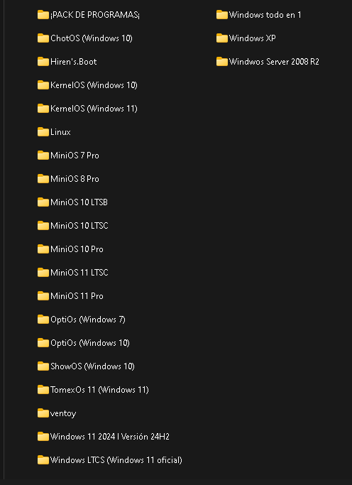
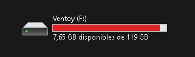

# 📦 Instrucciones de Instalación: Ventoy + MiniOS

Este proyecto te permite preparar un USB booteable con **Ventoy** y versiones livianas de Windows (MiniOS) comprimidas en archivos `.rar`.

---

## 🔧 Pasos para instalar Ventoy y cargar MiniOS

1. Descargá la última versión de Ventoy desde su sitio oficial:  
   👉 [https://www.ventoy.net/en/download.html](https://www.ventoy.net/en/download.html)

2. Instalá Ventoy en tu pendrive con el instalador correspondiente.

3. Descargá el siguiente archivo que contiene la estructura y los scripts necesarios:  
   👉 [Mi plantilla ventoy](https://www.mediafire.com/file/8qlhypkpnoev9uo/ventoy.rar/file)

4. Descomprimí `ventoy.rar` en la raíz del USB donde instalaste Ventoy.

5. Descargá las ISOs MiniOS desde los enlaces listados en el archivo [README](README.md) y colocalas en la carpeta `/ISO/`.

---

📌 **Nota importante:**  
El archivo `ventoy.rar` está protegido con contraseña.

✉️ **Para obtener la clave**, escribime directamente por **WhatsApp** al:

👉 **+58 412 905 6224**

Estoy para ayudarte con lo que necesites y también ofrezco servicios personalizados como:

- 🔄 Subida de nuevas imágenes ISO.
- 📦 Paquetes de drivers offline (actualizados).
- 💾 Programas esenciales listos para instalar.
- 💻 Asesoría técnica para customizar tu USB booteable.

---

💡 Este proyecto está pensado para facilitarte la vida. Si querés colaborar o tenés ideas para mejorar, ¡sos bienvenido!
