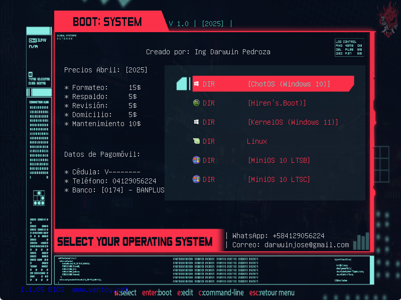

# 💻 Ventoy + MiniOS Project

Este repositorio ofrece una guía completa y recursos para instalar **Ventoy** con varias imágenes ISO personalizadas de Windows MiniOS, ideales para técnicos, usuarios avanzados o quienes deseen un sistema liviano y optimizado.

📖 Para instrucciones detalladas paso a paso, consulta el archivo [INSTALL.md](INSTALL.md).

---

## 📦 Enlaces de descarga (.ISO comprimidas en .rar con contraseña)

🔐 **Contraseña de los archivos .rar:** `www.dprojects.org.rar`

Los enlaces son **directos por MediaFire** y **sin publicidad**:

### 🪟 MiniOS - Versiones disponibles

- [MiniOS10 LTSB v2025.01 x64](https://www.mediafire.com/file/rurtlplyfu9ey52/MiniOS10_LTSB_v2025.01_x64_-_www.dprojects.org.rar/file)
- [MiniOS10 LTSC-1809 v2025.01 x64](https://www.mediafire.com/file/0pe8c12yepfglz8/MiniOS10_LTSC-1809_v2025.01_x64_-_www.dprojects.org.rar/file)
- [MiniOS10 LTSC-21H2 v2025.01 x64](https://www.mediafire.com/file/wl8tc1o1lpetngb/MiniOS10_LTSC-21H2_v2025.01_x64_-_www.dprojects.org.rar/file)
- [MiniOS10 Pro v2025.01 x64](https://www.mediafire.com/file/od2rqng1guazmtm/MiniOS10_Pro_v2025.01_x64_-_www.dprojects.org.rar/file)
- [MiniOS11 LTSC v2025.01 x64](https://www.mediafire.com/file/pv1w475duj616ah/MiniOS11_LTSC_v2025.01_x64_-_www.dprojects.org.rar/file)
- [MiniOS11 Pro v2025.01 x64](https://www.mediafire.com/file/ucnzqj9j1bmer7u/MiniOS11_Pro_v2025.01_x64_-_www.dprojects.org.rar/file)
- [MiniOS7 Pro v2025.01 x64](https://www.mediafire.com/file/ko7jgs0vjd64cbf/MiniOS7_Pro_v2025.01_x64_-_www.dprojects.org.rar/file)
- [MiniOS8 Pro v2025.01 x64](https://www.mediafire.com/file/je1u8f5bzgxks0d/MiniOS8_Pro_v2025.01_x64_-_www.dprojects.org.rar/file)

### 🎮 OptiOS - Optimizado para gaming

- [OptiOS 11 24H2 x64](https://www.mediafire.com/file/ajfh3oklpt77ael/OptiOS_11_24H2_x64.iso/file)
- [OptiOS 7 x64](https://www.mediafire.com/file/7ymoajtoesbbwg7/OptiOS_7_x64.iso/file)

---

## 📁 Plantilla base + scripts Ventoy

🔧 Descargar plantilla base con estructura, carpetas y scripts:
- [Ventoy.rar (pedir contraseña vía WhatsApp)](https://www.mediafire.com/file/8qlhypkpnoev9uo/ventoy.rar/file)

💲 **La contraseña del archivo `.rar` tiene un costo de $5 USD.**

Métodos de pago disponibles:
- Binance (USDT - TRC20)
- Cuentas bancarias de Venezuela: Banco de Venezuela y Banplus

📲 Solicita la clave por WhatsApp y elige tu método de pago:
👉 [Solicitar clave de la plantilla](https://wa.me/584129056224?text=Solicito%20la%20clave%20de%20la%20plantilla%20Ventoy%20y%20quiero%20conocer%20los%20m%C3%A9todos%20de%20pago)

Ofrecemos servicios como:
- Subida personalizada de nuevas imágenes
- Integración de drivers
- Packs de programas portables
- Mantenimiento y configuración personalizada

---

## 📂 Recursos adicionales útiles

- [Driver Pack](https://www.mediafire.com/file/38lsytdfv4mlsei/Driver_pack.rar/file)
- [SoftPack 2018 Lite](https://www.mediafire.com/file/kaxkhlb6n6be7p3/Softpack2018_lite_18.0.1.rar/file)
- [MobaLiveCD v2.1 (emulador para probar ISOs)](https://www.mediafire.com/file/u104n5fuhs3cx2s/MobaLiveCD_v2.1.exe/file)

---

## 🚀 Cómo empezar

1. Descargar la última versión de Ventoy desde su web oficial:  
   🔗 https://www.ventoy.net/en/download.html

2. Instalar Ventoy en una unidad USB.
3. Extraer el contenido de la plantilla `Ventoy.rar` en la raíz de la USB.
4. Copiar tus ISOs descomprimidas en la carpeta correspondiente.
5. ¡Listo! Bootear y disfrutar del menú personalizado.

---

## 🤝 Contribuir

¿Querés apoyar este proyecto y fomentar más contenido gratuito, optimizado y sin publicidad?

💸 **Aceptamos donaciones vía Binance (USDT - TRC20):**  
`TQxzqHUYu3GfgfphWjAZMLPhb8UrAju3kj`

¡Gracias por apoyar el software libre y la comunidad DIY! 🙌